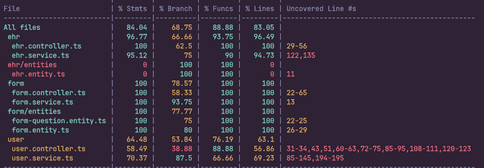

# Med Atlas

Med Atlas is a comprehensive healthcare management system built with modern technologies. This project uses a monorepo architecture with Turborepo to manage multiple applications and packages.

## Technology Stack

### Frontend (apps/web)

- Next.js 15
- React 19
- Tailwind CSS
- shadcn/ui (component library)
- TypeScript
- Zod (schema validation)

### Backend (apps/backend)

- NestJS 11
- Node.js
- Prisma ORM
- PostgreSQL
- Jest (testing)
- Comprehensive unit and integration tests

```sh
npx turbo test
```

#### Backend Test Coverage

The backend has extensive test coverage across all modules:



### Shared Packages (packages/\*)

- `api`: Contains DTOs and entities shared between frontend and backend
- `types`: Contains simple TypeScript interfaces
- `typescript-config`: Shared TypeScript configuration
- `eslint-config`: Shared ESLint configuration
- `ui`: Shared UI components

## Development Principles

- Agile methodologies
- SOLID principles
- Clean architecture
- Test-driven development

## Getting Started

### Prerequisites

- Node.js (v18 or higher)
- npm (v11 or higher)
- PostgreSQL (for local development)

### Installation

1. Clone the repository:

   ```sh
   git clone https://github.com/iamfelipe/med-atlas.git
   cd med-atlas
   ```

2. Make sure you're on the main branch:

   ```sh
   git checkout main
   ```

3. Set up environment variables:

   - Copy the `.env.example` files to `.env` in both the backend and web applications:
     ```sh
     cp apps/backend/.env.example apps/backend/.env
     cp apps/web/.env.example apps/web/.env
     ```

4. Install dependencies:

   ```sh
   npm install
   ```

5. Generate Prisma client:
   ```sh
   npx turbo db:generate
   ```

### Running the Project

Start the development servers:

```sh
npx turbo dev
```

This will start:

- Frontend: http://localhost:3000
- Backend: http://localhost:5005

### Available Scripts

- `npm run build`: Build all applications and packages
- `npm run dev`: Start all applications in development mode
- `npm run lint`: Run linting on all applications and packages
- `npm run format`: Format code using Prettier
- `npm run check-types`: Check TypeScript types
- `npm run test`: Run tests across all applications and packages

### Backend-specific Commands

- `npx turbo db:generate`: Generate Prisma client
- `npx turbo db:migrate`: Run database migrations
- `npx turbo db:studio`: Open Prisma Studio to manage database
- `npx turbo test`: Run all tests (unit and integration)
- `npx turbo test:cov`: Run tests with coverage reports
- `npx turbo test:cov:detail`: Generate detailed coverage reports

## Project Structure

```
med-atlas/
├── apps/
│   ├── backend/         # NestJS backend application
│   └── web/             # Next.js frontend application
├── packages/
│   ├── api/             # Shared DTOs and entities
│   ├── eslint-config/   # Shared ESLint configuration
│   ├── typescript-config/ # Shared TypeScript configuration
│   ├── types/           # Shared TypeScript interfaces
│   └── ui/              # Shared UI components
├── package.json         # Root package.json
└── turbo.json           # Turborepo configuration
```

## Features

The system manages:

- User information (patients, administrators)
- Electronic Health Records (EHR)
- Form assignments and submissions
- EHR field mappings

## Contributing

1. Create a feature branch (`git checkout -b feature/amazing-feature`)
2. Commit your changes (`git commit -m 'Add some amazing feature'`)
3. Push to the branch (`git push origin feature/amazing-feature`)
4. Open a Pull Request

## License

This project is licensed under the [MIT License](LICENSE).

## System Functionality

### Authentication and User Roles

When you first access the application, you'll need to create an account:

- Sign up using your Google account or email and password (`http://localhost:3000`)
- Verify your email address for enhanced security
- By default, new users are assigned the admin role and redirected to the dashboard
- Users with the patient role are redirected to their checkup form if they have an EHR assigned

### Admin Dashboard (`http://localhost:3000/dashboard`)

The admin dashboard consists of three main sections:

#### 1. Users Management (`http://localhost:3000/dashboard/users`)

- View all registered users
- Edit user roles (admin/patient)
- Delete users from the system

#### 2. Patients Management (`http://localhost:3000/dashboard/patient`)

- View all patients in the system
- Assign an EHR to a patient
- Monitor form completion status for patients with assigned EHRs
- View patient details (`http://localhost:3000/dashboard/patient/[id]`)
- Review form responses submitted by patients (`http://localhost:3000/dashboard/patient/[id]/form`)

#### 3. EHR Management (`http://localhost:3000/dashboard/ehr`)

- View all Electronic Health Record systems
- Create new EHR configurations (`http://localhost:3000/dashboard/ehr/create`)
- Update existing EHR configurations (`http://localhost:3000/dashboard/ehr/[id]`)
- When updating an EHR, new fields are automatically added to forms assigned to users

#### Creating/Editing an EHR (`http://localhost:3000/dashboard/ehr/create` or `http://localhost:3000/dashboard/ehr/[id]`)

When creating or editing an EHR, you can configure various field mappings:

- Define field names and types (string, number, date, boolean, etc.)
- Specify API endpoints for data retrieval
- Configure mapping paths for data extraction
- Set required fields
- Add options for dropdown menus or multiple-choice selections

### Patient Portal (`http://localhost:3000`)

Patients with the patient role experience a different interface:

- If an EHR is assigned, a form is automatically rendered for the patient to complete (`http://localhost:3000`)
- After submission, the form status changes to "completed"
- Patients can view their submitted responses
- The system stores these responses for review by administrators

### API Endpoints

The backend provides the following main API endpoints:

#### User Endpoints

- `GET /user` - Get all users
- `GET /user/patient` - Get all patients
- `GET /user/:id` - Get a specific user by ID
- `POST /user` - Create a new user
- `PUT /user/:id` - Update a user
- `DELETE /user/:id` - Delete a user
- `PATCH /user/:id/ehr` - Assign an EHR to a user

#### EHR Endpoints

- `GET /ehr` - Get all EHRs
- `GET /ehr/:id` - Get a specific EHR by ID
- `POST /ehr` - Create a new EHR
- `PUT /ehr/:id` - Update an EHR
- `DELETE /ehr/:id` - Delete an EHR

#### Form Endpoints

- `GET /form` - Get all forms
- `GET /form/:id` - Get a specific form by ID
- `GET /form/user/:userId` - Get a form for a specific user
- `POST /form` - Create a new form
- `PUT /form/:id` - Update a form
- `DELETE /form/:id` - Delete a form

This workflow enables efficient data collection from patients while providing administrators with tools to manage users, EHRs, and form submissions in a centralized system.

## Roadmap

The following features and improvements are planned for future development:

### Security Enhancements

- Add service-level validation to ensure only users with appropriate permissions can make changes
  - Example: Only users with `create:ehr` permission can create an EHR
  - Patient users would have no `permission:ehr` capabilities
- Protect frontend routes to restrict access based on user roles
  - Currently, routes are open for testing purposes

### Internationalization

- Add localization support for multiple languages
- Implement language selection for users

### Bulk Operations

- Add functionality to handle bulk changes
- Support CSV uploads for batch processing of user information and EHR data

### Testing Improvements

- Implement integration tests for the frontend
- Add end-to-end (E2E) tests for the frontend
- Increase test coverage across the application
  - **Note**: The backend already has comprehensive unit and integration tests implemented with high coverage
